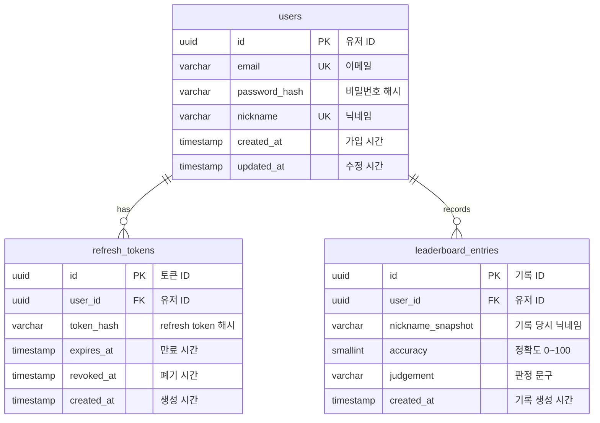

# 충전기 타이밍 게임 MVP ERD

## 1. ERD 개요

충전기 타이밍 게임 MVP의 데이터베이스 설계 문서이다.

MVP에서는 로컬 이메일 로그인, JWT refresh token 관리, 리더보드 기록 저장을 제공한다.

## 2. ERD



## 3. 테이블 목록

| 테이블명            | 설명                                               |
| ------------------- | -------------------------------------------------- |
| users               | 이메일 로그인 계정 정보를 저장하는 테이블          |
| refresh_tokens      | JWT refresh token rotation을 위한 토큰 저장 테이블 |
| leaderboard_entries | 플레이 결과와 리더보드 기록을 저장하는 테이블      |

## 4. users

### 설명

회원가입한 플레이어의 계정 정보를 저장한다.

### 컬럼

| 컬럼명        | 타입         | Null | 기본값    | 설명                 |
| ------------- | ------------ | ---- | --------- | -------------------- |
| id            | uuid         | N    | 자동 생성 | 유저 ID              |
| email         | varchar(255) | N    | 없음      | 로그인 이메일        |
| password_hash | varchar(255) | N    | 없음      | 해시된 비밀번호      |
| nickname      | varchar(12)  | N    | 없음      | 리더보드 표시 닉네임 |
| created_at    | timestamp    | N    | 현재 시각 | 가입 시간            |
| updated_at    | timestamp    | N    | 현재 시각 | 수정 시간            |

### 제약 조건

| 이름                      | 조건                                     | 설명                  |
| ------------------------- | ---------------------------------------- | --------------------- |
| pk_users                  | `id` primary key                         | 유저 고유 식별자      |
| uq_users_email            | `email` unique                           | 이메일 중복 가입 방지 |
| uq_users_nickname         | `nickname` unique                        | 닉네임 중복 방지      |
| chk_users_nickname_length | `char_length(nickname) between 2 and 12` | 닉네임 길이 제한      |

### 검증 규칙

- 이메일은 소문자로 정규화해서 저장한다.
- 비밀번호는 DB에 원문 저장하지 않는다.
- 비밀번호는 bcrypt 또는 argon2 해시로 저장한다.
- 닉네임은 한글, 영문, 숫자만 허용한다.
- 닉네임 금칙어 필터링은 애플리케이션 레이어에서 처리한다.

## 5. refresh_tokens

### 설명

JWT refresh token rotation을 관리한다.

### 컬럼

| 컬럼명     | 타입         | Null | 기본값    | 설명                    |
| ---------- | ------------ | ---- | --------- | ----------------------- |
| id         | uuid         | N    | 자동 생성 | 토큰 ID                 |
| user_id    | uuid         | N    | 없음      | 유저 ID                 |
| token_hash | varchar(255) | N    | 없음      | refresh token 해시      |
| expires_at | timestamp    | N    | 없음      | refresh token 만료 시간 |
| revoked_at | timestamp    | Y    | null      | 폐기 시간               |
| created_at | timestamp    | N    | 현재 시각 | 생성 시간               |

### 제약 조건

| 이름                         | 조건                             | 설명                          |
| ---------------------------- | -------------------------------- | ----------------------------- |
| pk_refresh_tokens            | `id` primary key                 | 토큰 고유 식별자              |
| fk_refresh_tokens_user_id    | `user_id` references `users(id)` | 토큰 소유 유저                |
| uq_refresh_tokens_token_hash | `token_hash` unique              | 같은 토큰 해시 중복 저장 방지 |

### 처리 규칙

- refresh token 원문은 저장하지 않는다.
- refresh token은 해시로만 저장한다.
- access token 재발급 성공 시 기존 refresh token은 `revoked_at`을 기록해 폐기한다.
- 새 refresh token을 발급하고 새 해시를 저장한다.
- 폐기된 refresh token 재사용이 감지되면 해당 유저의 활성 refresh token을 모두 폐기한다.

## 6. leaderboard_entries

### 설명

플레이어가 게임을 완료한 뒤 정확도를 제출하면 저장되는 리더보드 기록 테이블이다.

### 컬럼

| 컬럼명 | 타입 | Null | 기본값 | 설명 |
| ---
| --- | --- | --- | --- |
| id | uuid | N | 자동 생성 | 리더보드 기록 ID |
| user_id | uuid | N | 없음 | 유저 ID |
| nickname_snapshot | varchar(12) | N | 없음 | 기록 당시 닉네임 |
| accuracy | smallint | N | 없음 | 정확도, 0~100 정수 |
| judgement | varchar(20) | N | 없음 | 정확도 기준 판정 문구 |
| created_at | timestamp | N | 현재 시각 | 기록 생성 시간 |

### 제약 조건

| 이름                              | 조건                             | 설명                    |
| --------------------------------- | -------------------------------- | ----------------------- |
| pk_leaderboard_entries            | `id` primary key                 | 기록 고유 식별자        |
| fk_leaderboard_entries_user_id    | `user_id` references `users(id)` | 기록 소유 유저          |
| chk_leaderboard_entries_accuracy  | `accuracy between 0 and 100`     | 정확도 범위 제한        |
| chk_leaderboard_entries_judgement | `judgement in (...)`             | 허용된 판정 문구만 저장 |

### judgement 허용값

| 값             | 정확도 범위 |
| -------------- | ----------- |
| PERFECT_CHARGE | 100         |
| GREAT          | 90~99       |
| GOOD           | 70~89       |
| WEAK           | 40~69       |
| BAD            | 1~39        |
| MISS           | 0           |

## 7. 인덱스

| 인덱스명                           | 컬럼                                             | 목적                      |
| ---------------------------------- | ------------------------------------------------ | ------------------------- |
| idx_users_email                    | `email`                                          | 로그인 이메일 조회 최적화 |
| idx_users_nickname                 | `nickname`                                       | 닉네임 중복 확인 최적화   |
| idx_refresh_tokens_user_id         | `user_id`                                        | 유저별 refresh token 조회 |
| idx_refresh_tokens_active          | `user_id, expires_at` where `revoked_at is null` | 활성 refresh token 조회   |
| idx_leaderboard_entries_rank       | `accuracy desc, created_at asc`                  | 리더보드 순위 조회 최적화 |
| idx_leaderboard_entries_user_id    | `user_id`                                        | 유저별 기록 확장 대비     |
| idx_leaderboard_entries_created_at | `created_at desc`                                | 최근 기록 조회 확장 대비  |

## 8. 정렬 및 순위 규칙

리더보드는 아래 기준으로 정렬한다.

1. `accuracy` 높은 순
2. `created_at` 빠른 순

동일 정확도일 경우 먼저 등록된 기록이 더 높은 순위를 가진다.

## 9. PostgreSQL DDL 예시

```sql
create table users (
  id uuid primary key default gen_random_uuid(),
  email varchar(255) not null,
  password_hash varchar(255) not null,
  nickname varchar(12) not null,
  created_at timestamp not null default now(),
  updated_at timestamp not null default now(),

  constraint uq_users_email unique (email),
  constraint uq_users_nickname unique (nickname),
  constraint chk_users_nickname_length
    check (char_length(nickname) between 2 and 12)
);

create table refresh_tokens (
  id uuid primary key default gen_random_uuid(),
  user_id uuid not null,
  token_hash varchar(255) not null,
  expires_at timestamp not null,
  revoked_at timestamp null,
  created_at timestamp not null default now(),

  constraint fk_refresh_tokens_user_id
    foreign key (user_id) references users(id) on delete cascade,
  constraint uq_refresh_tokens_token_hash unique (token_hash)
);

create table leaderboard_entries (
  id uuid primary key default gen_random_uuid(),
  user_id uuid not null,
  nickname_snapshot varchar(12) not null,
  accuracy smallint not null,
  judgement varchar(20) not null,
  created_at timestamp not null default now(),

  constraint fk_leaderboard_entries_user_id
    foreign key (user_id) references users(id) on delete cascade,
  constraint chk_leaderboard_entries_accuracy
    check (accuracy between 0 and 100),
  constraint chk_leaderboard_entries_judgement
    check (
      judgement in (
        'PERFECT_CHARGE',
        'GREAT',
        'GOOD',
        'WEAK',
        'BAD',
        'MISS'
      )
    )
);

create index idx_users_email
  on users (email);

create index idx_users_nickname
  on users (nickname);

create index idx_refresh_tokens_user_id
  on refresh_tokens (user_id);

create index idx_refresh_tokens_active
  on refresh_tokens (user_id, expires_at)
  where revoked_at is null;

create index idx_leaderboard_entries_rank
  on leaderboard_entries (accuracy desc, created_at asc);

create index idx_leaderboard_entries_user_id
  on leaderboard_entries (user_id);

create index idx_leaderboard_entries_created_at
  on leaderboard_entries (created_at desc);
```

## 10. TypeORM Entity 설계 기준

### User Entity

| Entity 필드  | DB 컬럼       | TypeScript 타입 | 설명             |
| ------------ | ------------- | --------------- | ---------------- |
| id           | id            | string          | UUID primary key |
| email        | email         | string          | 로그인 이메일    |
| passwordHash | password_hash | string          | 비밀번호 해시    |
| nickname     | nickname      | string          | 닉네임           |
| createdAt    | created_at    | Date            | 가입 시간        |
| updatedAt    | updated_at    | Date            | 수정 시간        |

### RefreshToken Entity

| Entity 필드 | DB 컬럼    | TypeScript 타입 | 설명               |
| ----------- | ---------- | --------------- | ------------------ |
| id          | id         | string          | UUID primary key   |
| userId      | user_id    | string          | 유저 ID            |
| tokenHash   | token_hash | string          | refresh token 해시 |
| expiresAt   | expires_at | Date            | 만료 시간          |
| revokedAt   | revoked_at | Date \| null    | 폐기 시간          |
| createdAt   | created_at | Date            | 생성 시간          |

### LeaderboardEntry Entity

| Entity 필드      | DB 컬럼           | TypeScript 타입 | 설명             |
| ---------------- | ----------------- | --------------- | ---------------- |
| id               | id                | string          | UUID primary key |
| userId           | user_id           | string          | 유저 ID          |
| nicknameSnapshot | nickname_snapshot | string          | 기록 당시 닉네임 |
| accuracy         | accuracy          | number          | 정확도           |
| judgement        | judgement         | string          | 판정 문구        |
| createdAt        | created_at        | Date            | 기록 생성 시간   |

## 11. MVP 제외 테이블

MVP에서는 아래 테이블을 생성하지 않는다.

| 테이블명                  | 제외 이유                        |
| ------------------------- | -------------------------------- |
| oauth_accounts            | OAuth 로그인을 MVP에서 제외      |
| password_reset_tokens     | 비밀번호 찾기를 MVP에서 제외     |
| game_sessions             | 비정상 점수 방지는 MVP 이후 개선 |
| stages                    | 스테이지 기능 제외               |
| achievements              | 업적 기능 제외                   |
| user_achievements         | 업적 기능 제외                   |
